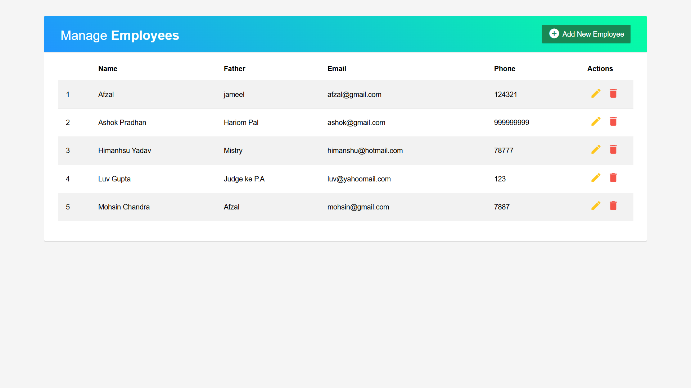
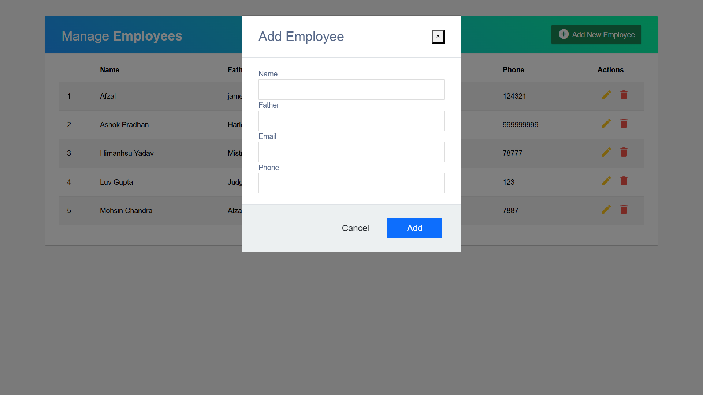
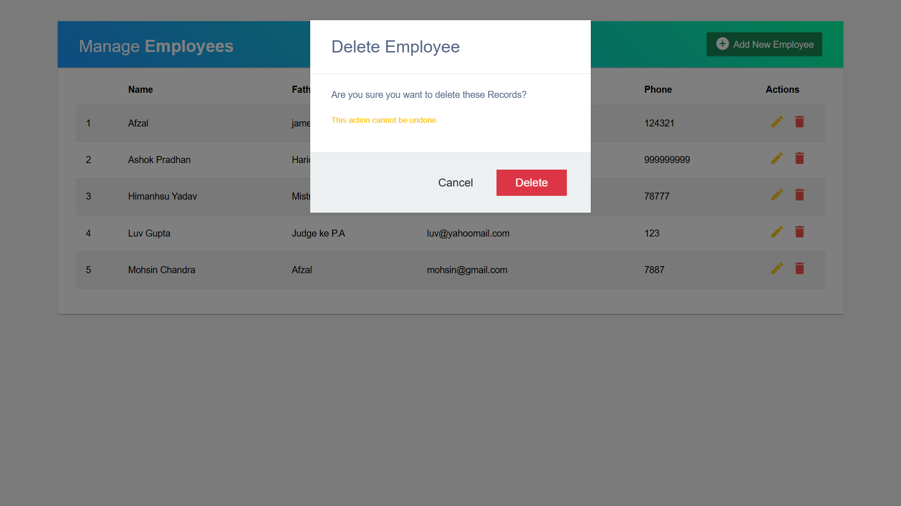

# CRUD Operations - Full Stack Application 🚀

Welcome to my **CRUD Operations** app, where I showcase my skills by performing **Create**, **Read**, **Update**, and **Delete** operations using **React** on the frontend and **Node.js/Express** on the backend. 🌐

This app is designed to demonstrate basic CRUD operations on a list of employees. 💼

### **Features** 🔧:
- **Create:** ✨ Add new employees to the list.
- **Read:** 📑 View a list of all employees.
- **Update:** ✍️ Edit employee details.
- **Delete:** ❌ Remove an employee from the list.

### **Tech Stack** 🛠️:
- **Frontend:** React, Vite, Axios, Bootstrap
- **Backend:** Node.js, Express, MongoDB
- **Database:** MongoDB (using Mongoose for ORM)

---

## **Preview** 📸

Here are some screenshots of the app in action:

### 1. **Login / Home Page** 👥:
Welcome to the app! Here, you can view the list of employees and perform CRUD operations.


### 2. **Add Employee Modal** ➕:
Easily add new employees through this intuitive modal.


### 3. **Edit Employee Modal** ✏️:
Edit existing employee details in this user-friendly modal.


### 4. **Delete Employee Confirmation** 🗑️:
Confirm before deleting an employee to avoid accidental deletions.


---

## **Installation Instructions** ⚙️

Follow these steps to get the project up and running:

### **1. Clone the Repository** 🧑‍💻
Clone both the **frontend** and **backend** repositories to your local machine.

```bash
git clone https://github.com/Afzal-Mia/CRUD_OPERATION.git
